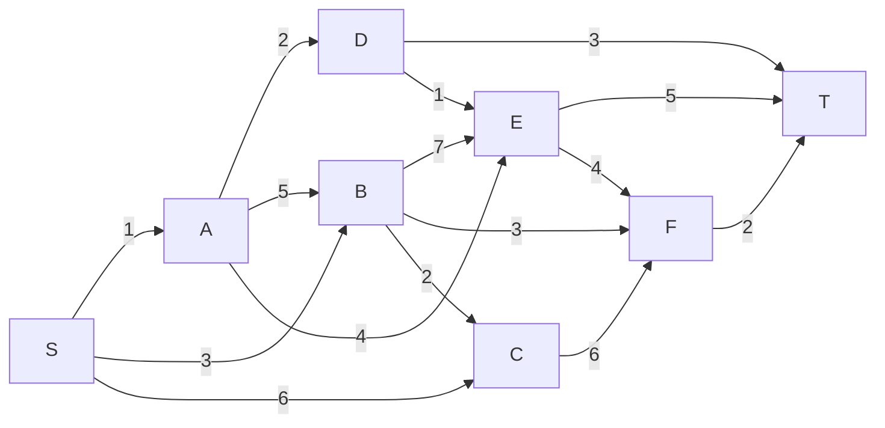

# Trabalho 10 - Levada 
    Nome: Antônio Cícero Amorim de Azevedo
    Ra: 811455 
> Caminhos Mínimos

### 1 - Questão 
Dado o algortimo de Dijstra explique seu funcionamento.
```py
def dijkstra(G, w, s):
    for v in G.vertices:
        v.dist = float('inf')
        v.pred = None
    s.dist = 0
    pq = PriorityQeue(V)
    while pq != None:
        u = pq.pop()
        for v in v.vizinhos:
            relax(u, v, w)
    return
```
- O primeiro for é usado iniciar todos os vértices com sua distancia infinita e
seus predecessores como None
- Apos isso o vértice de partida é dado com distancia 0 e adicionado a fila de 
prioridade que funciona como uma min heap.
- E por ultimo um loop que itera ate não existir mais itens na fila de prioridade
- Dentro do loop extraímos o item da fila e fazemos o _relaxamento_ de todos os seus
vizinhos
- Relaxamento nada mais é que analisar a distancia atual para chegar em um determinado
vértice e a nova distancia possível que está sendo conhecida, caso isso ocorra
devemos atualizar sua distancia para essa nova e mudar seu predecessor.

### 2 - Questão 
Usar o algoritmo de dijkstra para o grafo a baixo, com _s_ sendo a raiz.


#### Fila de Prioridade
|Iteração|S|A|B|C|D|E|F|T|
|--------|-|-|-|-|-|-|-|-|
|1|0|$\infty$|$\infty$|$\infty$|$\infty$|$\infty$|$\infty$|$\infty$|
|2||1|3|6|$\infty$|$\infty$|$\infty$|$\infty$|
|3|||3|6|3|5|$\infty$|$\infty$|
|4||||5|3|5|6|$\infty$|
|5||||5||4|6|6|
|6|||||||6|6|
|7||||||||6|


#### Ordem de acesso
|Vertice|Vizinho|Distancia Vizinhos|Predecessor|
|-------|-------|------------------|-----------|
|S|{A, B, C}|{min($\infty$, 1), min($\infty$, 3), min($\infty$, 6)}|None|
|A|{B, D, E}|{min(3, 1+5), min($\infty$, 1+2), min($\infty$, 1+4)}|S|
|B|{C, E, F}|{min(6, 3+2), min(5, 7 + 3), min($\infty$, 3+3)}|S|
|D|{E, T}|{min(5, 1+3), min($\infty$, 3+3)}|A|
|E|{F, T}|{min(6, 4+4), min(6, 5+3)}|D|
|C|{F}|{min(6, 4+4)}|B|
|F|{T}|{min(6, 6+2)}|B|
|T|{}|{}|D|


### 3 - Questão 
