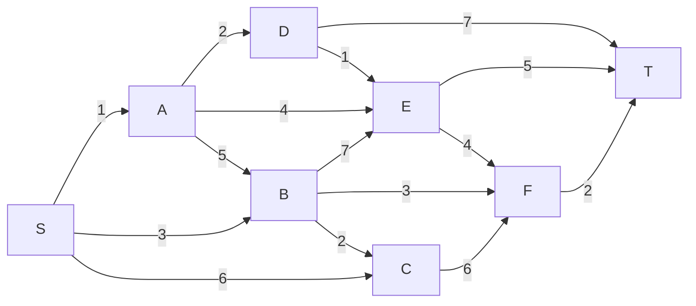
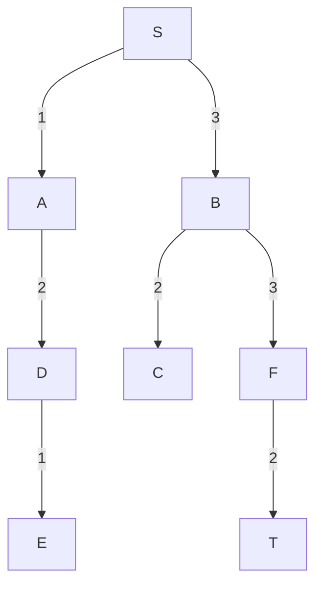

# Trabalho 10 - Levada 
    Nome: Antônio Cícero Amorim de Azevedo
    Ra: 811455 
> Caminhos Mínimos

### 1 - Questão 
Dado o algortimo de Dijkstra explique seu funcionamento.
```py
def dijkstra(G, w, s):
    for v in G.vertices:
        v.dist = float('inf')
        v.pred = None
    s.dist = 0
    pq = PriorityQeue(V)
    while pq != None:
        u = pq.pop()
        for v in v.vizinhos:
            relax(u, v, w)
    return
```
- O primeiro for é usado iniciar todos os vértices com sua distancia infinita e
seus predecessores como None
- Apos isso o vértice de partida é dado com distancia 0 e adicionado a fila de 
prioridade que funciona como uma min heap.
- E por ultimo um loop que itera ate não existir mais itens na fila de prioridade
- Dentro do loop extraímos o item da fila e fazemos o _relaxamento_ de todos os seus
vizinhos
- Relaxamento nada mais é que analisar a distancia atual para chegar em um determinado
vértice e a nova distancia possível que está sendo conhecida, caso isso ocorra
devemos atualizar sua distancia para essa nova e mudar seu predecessor.

### 2 - Questão 
Usar o algoritmo de dijkstra para o grafo a baixo, com _s_ sendo a raiz.


#### Fila de Prioridade
|Iteração|S|A|B|C|D|E|F|T|
|--------|-|-|-|-|-|-|-|-|
|1|0|$\infty$|$\infty$|$\infty$|$\infty$|$\infty$|$\infty$|$\infty$|
|2||1|3|6|$\infty$|$\infty$|$\infty$|$\infty$|
|3|||3|6|3|5|$\infty$|$\infty$|
|4||||5|3|5|6|$\infty$|
|5||||5||4|6|10|
|6||||5|||6|10|
|7|||||||6|9|
|8||||||||8|


#### Ordem de acesso
|Vertice|Vizinho|Distancia Vizinhos|Predecessor|
|-------|-------|------------------|-----------|
|S|{A, B, C}|{min($\infty$, 1), min($\infty$, 3), min($\infty$, 6)}|None|
|A|{B, D, E}|{min(3, 1+5), min($\infty$, 2), min($\infty$, 4)}|S|
|B|{C, E, F}|{min(6, 3+2), min(5, 3+7), min($\infty$, 3+3)}|S|
|D|{E, T}|{min(5, 3+1), min($\infty$, 3+7)}|A|
|E|{F, T}|{min(6, 4+4), min(10, 4+5)}|D|
|C|{F}|{min(6, 5+6)}|B|
|F|{T}|{min(9, 6+2)}|B|
|T|{}|{}|F|

#### Árvore de caminhos mínimos.


### 3 - Questão 
Mostrar que a complexidade do Dijkstra sem usar a fila de prioridade e lista de
adjacências é igual a $O(n^2)$.

- Começamos inicializando os vértices do nosso grafo, para distancia infinita e
sem predecessores, ficamos com $O(n)$

- Iniciamos o loop baseado na lista de vizinhos de um vértice que foi visitado,
ele vai passar por todos os vértices do grafo.

- Para encontrar o menor caminho possível devemos analisar todas as distancias,
tem a complexidade $O(n)$, pois deve achar um vértice vizinho com a menor distancia
possível.

- Ao encontrar a aresta de menor valor devemos fazer o relaxamento do mesmo, para
uma possível atualização do seu valor, tem a complexidade $O(1)$

- Dessa forma ficamos com:
$$ T(n) = O(n) + O(n)*O(n)*O(1) $$

- Ignorando as constantes:
$$ T(n) = O(n) + O(n)*O(n)$$

- Complexidade:
$$ O(n^2)$$

### 4 - Questão
Mostrar que a complexidade do Dijkstra usando a fila de prioridade e a lista de
adjacências é $O(m\log{n})$

- Iniciando os vértices do nosso grafo, com distancia infinita e sem predecessores,
temos que a complexidade é igual a $O(n)$.

- Apos isso iniciamos o vertice de partida com distancia zero e colocar ele na 
fila de prioridade

- Executamos o loop while enquanto a fila de prioridade nao for nula. A menor 
distancia é removida da fila de prioridade com $O(\log{n})$. Será removido n vértices

- Em um loop interno inserimos todos os vizinhos do vértice que está sendo analisado,
a e fazemos o relaxamento que tem complexidade $O(1)$. Esse relaxamento será feito
em todas as arestas $O(m)$. Além disso devemos atualizar os valores na fila de 
prioridade com a complexidade $O(\log{n})$

- Dessa forma temos que a equação será:
$$ T(n) = O(n) + n*O(\log{n}) + (O(1) + \log{n})*m $$

- Simplificando a equação:
$$ T(n) = O(n) + n*O(\log{n}) + \log{n}*m $$

-Temos que a complexidade do Dijkstra otimizado é:
$$ (n+m)\log{n} $$

- Podemos simplificar mais ainda, dado que em grafos convexo tem $m > (n-1)$
$$ m\log{n} $$

### 5 - Questão 
Mostrar que o algoritmo de Dijkstra com raiz em s sempre gera uma árvore de
caminhos mínimos, ou seja, que o algoritmo termina com $λ (v )≥d(s , v)$ , onde
$d ( s , v )$ denota a distância geodésica de $s a v, ∀ v∈V$

- Supondo que $λ(u) \neq d(s,u)$
- Isso implica que existe um caminho minimo de s até u passando por outros vértices
- Supondo que temos como esse caminho minimo a seguinte sequencia s -> xy(p1) -> 
u(p2)
$$λ ( y )=λ (x)+ w( x , y )=d(s , x )+ w( x , y)=d (s , y)$$

- Porem como y é o predecessor de u ficamos com:
$$d (s , y) \leq d (s , u)$$

- Temos então
$$λ ( y )=d ( s , y) \leq d (s , u)≤λ (u)$$

- Dessa forma temos duas equaçoẽs 
$$ 1) λ( y) \leq λ(u)$$
$$ 2) λ(u) \leq λ( y )$$

- Chegamos que $λ(u) = λ(y)$, o que é uma contradição a nossa hipotese inicial.

- Portanto $∄u ∈V$ tal que $λ (u)≠d ( s , u)$ quando $u$ entra em $S$
