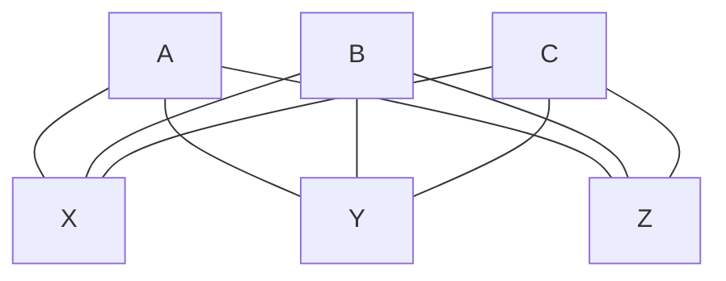

# Trabalho 8 - Levada 
    Nome: Antônio Cícero Amorim de Azevedo
    Ra: 811455 
> Fundamentos Básicos de Grafos

### 1 - Questão 
Problema: 9 vértices com 3 arestas por vértices. É possível construir esse grafo?
- A condição de existência de um grafo está baseada no _Handshaking Lema_. Sendo
dada por: a soma dos graus dos vértices de um grafo G é igual a duas vezes o número
de arestas.
$$ \sum_{i=1}^{n} d(v_{i}) = 2m$$

- Substituindo os valores:

$$ 9 * 3  = 2m$$
$$ 27 = 2m$$
$$ m = 13,5$$

- Como podemos perceber o número de arestas deu um valor quebrada, dessa forma
construir o grafo em questão se torna impossível.

### 2 - Questão 
Dado um grafo $G = (V, E)$ provar que $t = (k+1)n - 2m$, sendo $n$ o número de vértices, 
$m$ o número de arestas e deve ter $t$ vértices de grau $k$ e o restante dos 
vértices deve ter grau igual a $k+1$

- Usando o _Handshaking Lema_:
$$\sum_{i=1}^{t} d(v_{i}) \space  + \sum_{i=1}^{n-t} d(v_{i})  = \sum_{i=i}^{n} d(v_{i})$$
$$ t * k \space  + (n-t)*(k+1)  = 2m$$
$$ t * k \space  + n(k+1) - t(k+1)  = 2m$$
$$ t * k \space  + n(k+1) - t*k - t  = 2m$$
$$ n(k+1) - t  = 2m$$
$$t = n(k+1) - 2m$$

### 3 - Questão 
Dado uma festa com $n > 1$ pessoas, existe ao menos duas pessoas com mesmo número
de conhecidos.

- Sabendo que uma pessoa aleatória ela no minimo pode conhecer 0 pessoas, e no máximo
pode conhecer $n-1$ pessoas na festa.

- Analogamente podemos entender que pessoas são vértices de um grafo e que conhecidos
representa o grau desse vértice.

- E supondo que o número de conhecidos cresça de acordo com uma progressão aritmética 
de razão 1:
$$\{0, 1, 2, ..., n-2, n-1\}$$

- Nosso somatório de graus será:
$$ \sum_{i=0}^{n} d(v_{i}) = \frac{(n-1)n}{2} = 2m $$

- Generalizando para um valor de k:
$$\frac{(k-1)k}{2} = 2m$$

- Testando nossa hipóstase para $k+1$, temos que o numero de graus será $2m$ mais
k graus da próxima pessoa:
$$\frac{(k+1-1)(k+1)}{2} = 2m + k$$
$$\frac{(k)(k+1)}{2} = 2m + k$$
$$2m = 2m + k$$
$$0 = k$$
- Chegamos a um absurdo , invalidando nossa hipóstase inicial e validando a proposta
que deve existir ao menos uma pessoa com o mesmo número de conhecidos em uma festa.

### 4 - Questão 
Conhecendo o _friendship graphs_ responda as generalizações:
1. **Quantos vértices possui um grafo Fn?**
    - $1 + 2*n$, 1 já que deve ter um vértice comum a todos os triângulos, e o 
    restante dos triângulos devem ter dois vértices, para que a sua soma dos vértices 
    de um triângulos dê exatamente 3 vértices.
2. **Explicar a lista de graus de um grafo Fn?**
    - O vértice central tem seu grau igual ao número total de triângulos vezes 
    dois, já que ele será comum a todos os outros vértices presentes do grafo. 
    O restante dos vértices terão grau igual a 2, já que estão fazendo fronteira
    com o vértice central e vértice que responsavel pelo terceiro ponto do triangulo.
3. **Quantas arestas possui um grafo Fn?**
    - Baseado no _Handshaking Lema_ temos:
    $$\sum_{i=1}^{n} d(v_{i}) = 2m$$ 
    - O somatório será igual a:
    $$2n + 2 + 2 + 2 + ... + 2 = 2*m$$
    - Para cada triangulo, excluindo o vértice central, teremos 2 vértices com 
    grau igual a 2
    $$2n + 4*n = 2m$$
    $$6n = 2m$$
    $$ m = 3n $$
    - Sendo n a quantidade de triângulos presente no _friendship graphs_. 

### 5 - Questão 
Dado um grafo bipartido G = (V, E). Demostre que o número máximo de arestas é igual
a $\frac{v^2}{4}$

- Um grafo bipartido é dado a partir $V = X \cup Y \text{e} \space X \cap Y = \empty \space$ 

- Para chegar no número máximo de arestas devemos ter a mesma quantidade de vértices
para o grupo $X$ e o grupo $Y$

- Outro fator é que todos os vértices de $X$ devem estar relacionados com todos
os vértices de $Y$

- Como no exemplo a baixo:

- Podemos perceber que o grau de todos os vértices será igual a o número de vértices
sobre 2, chegamos a um possível somatório:
$$\sum_{i=1}^{\frac{n}{2}} \frac{n}{2}$$

- Expandindo o somatório chegamos em:
$$\frac{n}{2} *\frac{n}{2}$$

- Que por sua vez:
$$ \frac{n^2}{4}$$

- Sendo $n$ o número de vértices do nosso grafo bipartido.
