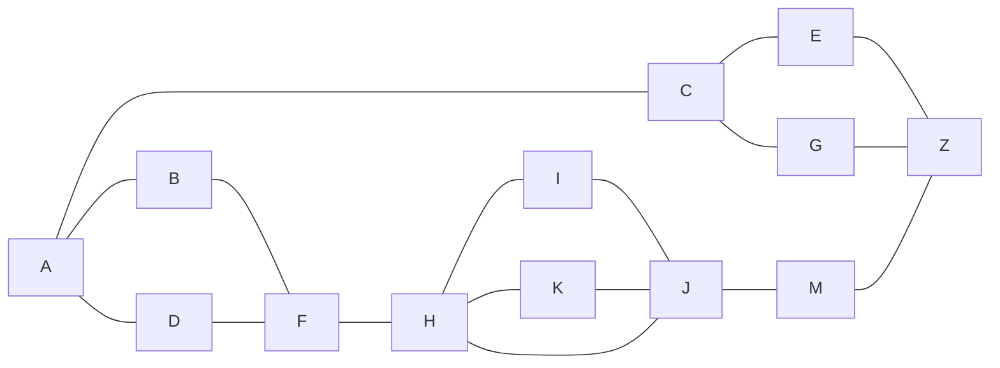
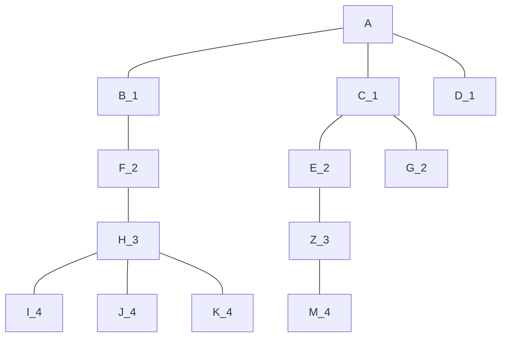
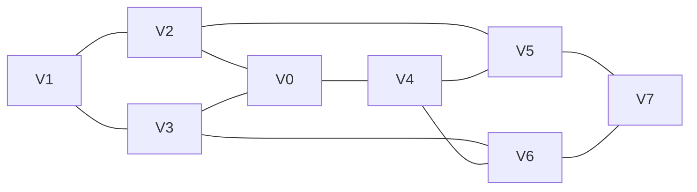

# Trabalho 9 - Levada 
    Nome: Antônio Cícero Amorim de Azevedo
    Ra: 811455 
> Busca em grafos (BFS e DFS)

### 1 - Questão 
Dado o algoritmo da BFS, comente sobre ele.
```py
def BFS(G, s):
    for v in G.vertices:
        if v != s:
            v.color = WHITE
            v.dist = float('inf')
            v.prede = None
    s.color = GRAY
    s.dist = 0
    queue = Qeue()
    queue.push(s)
    while len(queue) != 0:
        u = queue.pop()
        for v in u.neighbor:
            if v.color == WHITE:
                v.dist = u.dist + 1
                v.prede = u
                v.color = GRAY
                queue.push(v)
        u.color = BLACK
```
- No primeiro loop inicializamos os vértices, com a cor, o predecessor e a distância
- A inicialização do vértice raiz é feita após a saída do loop, alem de inicializar
a fila, onde começara com a raiz do grafo.
- Próximo passo é um loop while que itera até que não exista mais nenhum grafo 
interligado presente.
- Dessa forma passamos por todos os vizinhos do vértice atual e inserimos ele na
fila, atualizando o a cor, o predecessor e a distancia.
- Com o vizinho na fila, removemos ele e analisamos os seus vizinhos, caso ele 
ainda seja branco, o passo a passo deve ocorrer novamente, ate que todos os vizinhos
tenham sido analisados.

### 2 - Questão 
- Mostrar o passo a passo de um BFS a partir do grafo a baixo e desenhar sua 
árvore com as distâncias geodésicas. Vértice $A$ sendo a raiz.


| Iteração | Vértice | Vizinhos | Distancias | Predecessor |   FILA    |
|----------|---------|----------|------------|-------------|-----------|
| 0|A|{B, C, D}|0|None|{B, C, D}  |
| 1 |B| {F}| 0+1| A| {C, D, F}|
| 2 |C| {E, G}| 0+1| A| {D, F, E, G}|
| 3 |D|{F}| 0+1| A| {F, E, G}|
| 4 |F|{H}| 1 + 1| B| {E, G, H}|
| 5 |E|{Z}| 1+1| C| {G, H, Z}|
| 6 |G|{}| 1+1|C|{H, Z}|
| 7 |H|{I, J, K}| 2 + 1|F|{Z, I, J, K}|
| 8 |Z|{M}| 2 + 1|E|{I, J, K, M}|
| 9 |I|{}| 3 + 1|H|{J, K, M}|
| 10 |J|{}| 3 + 1|H|{K, M}|
| 11 |K|{}| 3 + 1|H|{M}|
| 12 |M|{}| 3 + 1|Z|{}|



### 3 - Questão 
Mostre que a Busca em Largura gera uma árvore de profundidade mínima, ou seja,
$\lambda (v) = d(s, v)$
- Essa propriedade ocorre devido o fato da BFS explorar todos os vértices de um
nível antes de passar para o próximo nível, dessa forma é garantido que ele pega
as menores distancias antes de se aprofundar em outros vértices.
- Como foi mostrado na questão anterior.

### 4 - Questão 
Mostrar a que a complexidade da busca em largura é $O(n+m)$, sendo $n$ o número
de vértices e $m$ o número de arestas.

- Iniciar os valores dos vértices $O(n)$
- Iniciar os valores da raiz e a fila. $O(1)$
- Por último um o while (baseado na fila) onde o número de iterações será a quantidade
de aretas presentes no grafos. $O(m)$
- Dessa forma:
$$ T(n) = n + 1 + m$$
$$ O(n+m)$$

### 5 - Questão 
Mostrar o passo a passo de uma DFS com o grafo a baixo.

| Vertice| d time| Vizinhos WHITE| Predecessor |  f time| Pilha|
|----------|---------|----------|-------------|---------|------|
|V0|1|{V2, V3, V4}|None|16|{V4, V3, V2}|
|V4|2|{V5, V6}|V0|15|{V6, V5, V3, V2}|
|V6|3|{V3, V7}|V4|14|{V7, V3, V5, V3, V2}|
|V7|4|{V5}|V6|13|{V5, V3, V5, V3, V2}|
|V5|5|{V2}|V7|12|{V2, V3, V5, V3, V2}|
|V2|6|{V1}|V5|11|{V1, V3, V5, V3, V2}|
|V1|7|{V3}|V2|10|{V3, V3, V5, V3, V2}|
|V3|8|{}|V1|9|{}|
