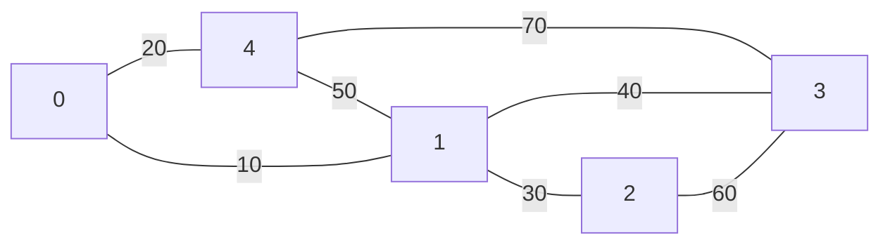
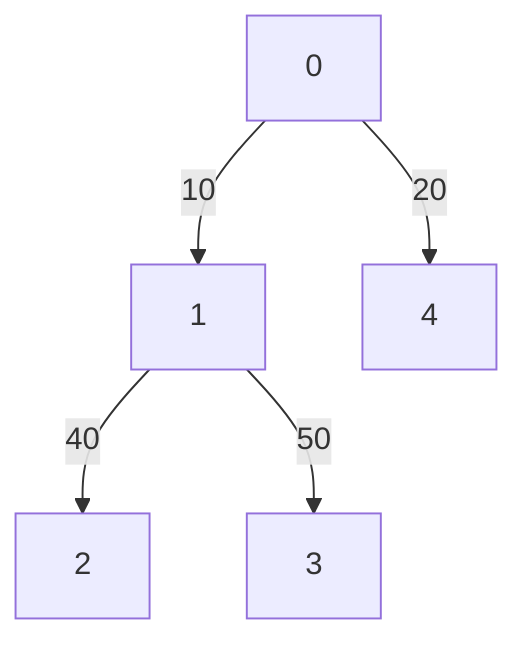
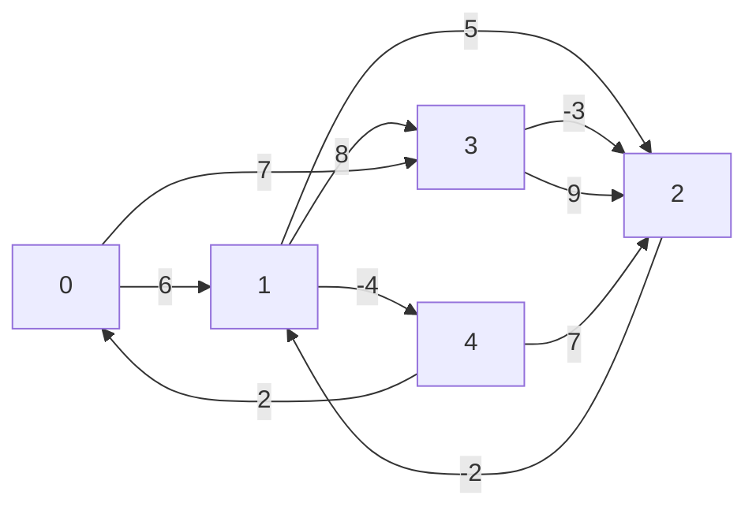
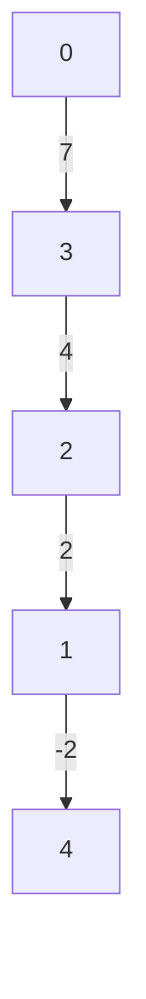

# Algoritmo de Dijkstra e Bellman-Ford
    Professor: Alexandre Levada
    Disciplina: Algoritmos e Estrutra de Dados
    Grupo:
        Antônio Cícero Amorim de Azevedo (811455)
        João Pedro Mansolelli (811805)

## Algoritmo de Dijkstra
### Conceito
- Encontrar caminhos mínimos em grafos ponderados
- Caminho ótimo: Soma dos pesos das arestas é a menor possível, dado um inicio e 
um destino.
- Primitiva Relax: Responsável por verificar se um caminho é melhor que o atual, 
caso ele seja devemos mudar a distancia minima atual e seu predecessor.
- Primitiva Fila de Prioridade Minima: o elemento com a menor distancia tem a 
prioridade mais alta sobre a fila, sendo sempre o próximo a ser removido.

### Implementação
##### Inicialização:

```py
def dijkstra(grafo: Grafo, inicio:int):
```
- Declara uma hash table de distancias para manter as distâncias mínimas estimadas do 
nó de origem para todos os outros nós. 
- Declara todas as distâncias com um valor infinito, exceto a distância do nó de 
origem, que tem distância 0.
- Declara uma hash table visitados para acompanhar quais nós já foram visitados. 
- Inicialmente, nenhum nó foi visitado.
- Declare sua fila de prioridade e insira como primeiro elemento o vértice de inicio.

```py
def dijkstra(grafo: Grafo, inicio:int):
    distancias = {}
    predecessor = {}
    visitados = set()
    for vertice in range(grafo.vertices):
        distancias[vertice] = float("inf")
        predecessor[vertice] = None
    distancias[inicio] = 0
    pqueue = []
    heapq.heappush(pqueue, (0, inicio))
```
##### Iterações: 
- Um loop while é iniciado baseado nos itens presentes na fila de prioridade,
enquanto houver itens ele estará sendo executado
- O item a ser analisado será o primeiro item da fila, com ele devemos observar
todos seus vizinhos diretos e para cada um fazer a operação de relaxamento
```py
def dijkstra(grafo: Grafo, inicio:int):
    while len(pqueue) != 0:
        d_atual, v_atual = heapq.heappop(pqueue)
        visitados.add(v_atual)

        for vizinho in range(grafo.vertices):
            if grafo.matrix[v_atual][vizinho] != 0 and vizinho not in visitados:
                distancia = grafo.matrix[v_atual][vizinho]
                # Relax
                if d_atual + distancia < distancias[vizinho]:
                    distancias[vizinho] = d_atual + distancia
                    heapq.heappush(pqueue, (distancias[vizinho], vizinho))

                    predecessor[vizinho] = v_atual
```
##### Resultados: 
- Após a conclusão do algoritmo, a hash table distancias conterá as distâncias 
mínimas estimadas do nó de origem para todos os outros nós do grafo. 
- Assim como a hash table predecessores que terá os valores de todos vértices do
grafo, sendo necessária para o desenho da árvore geradora minima.

##### Exemplo: 
- Sendo o vértice 0 o ponto de partida.

    Matriz de Adjacência:
    [0, 10, 0, 0, 20]                                                                           
    [10, 0, 30, 40, 50]                                                                         
    [0, 30, 0, 60, 0]                                                                           
    [0, 40, 60, 0, 70]                                                                          
    [20, 50, 0, 70, 0]   

    distancias =  {0: 0, 1: 10, 2: 40, 3: 50, 4: 20}                                            
    predecessor =  {0: None, 1: 0, 2: 1, 3: 1, 4: 0}  

- Árvore geradora minima


## Algoritmo de Bellman-Ford
- Desenvolvido devido uma falha no algoritmo de Dijkstra.
    - Não funciona corretamente quando o grafo admite pesos negativos em suas arestas.

- Apesar de ser menos eficiente ele é capaz de resolver esse problema, sendo
principalmente implementado em grafos direcionados ponderados.

##### Ideia Geral 
- Em cada etapa do algoritmo, devemos relaxar todas as arestas em uma ordem qualquer. 
- Esse processo deve ser repetido vértices menos uma vezes.

```py
def bellman_ford(grafo: Grafo, inicio:int):
    for _ in range(grafo.vertices - 1):
        for origem in range(grafo.vertices):
            for destino in range(grafo.vertices):
                if origem != destino and grafo.matrix[origem][destino] != 0:
                    distancia_atual = grafo.matrix[origem][destino]
                    if distancias[origem] + distancia_atual < distancias[destino]:
                        distancias[destino] = distancias[origem] + distancia_atual
                        predecessor[destino] = origem
    return distancias, predecessor
```

##### Exemplo: 
- Sendo o vértice 0 o ponto de partida.

    Matriz de Adjacência:
    [0, 6, 0, 7, 0]                                                                             
    [0, 0, 5, 8, -4]                                                                            
    [0, -2, 0, 0, 0]                                                                            
    [0, 0, -3, 0, 9]                                                                            
    [2, 0, 7, 0, 0]
    distancias =  {0: 0, 1: 2, 2: 4, 3: 7, 4: -2}                                               
    predecessor =  {0: None, 1: 2, 2: 3, 3: 0, 4: 1}  

- Árvore geradora minima


